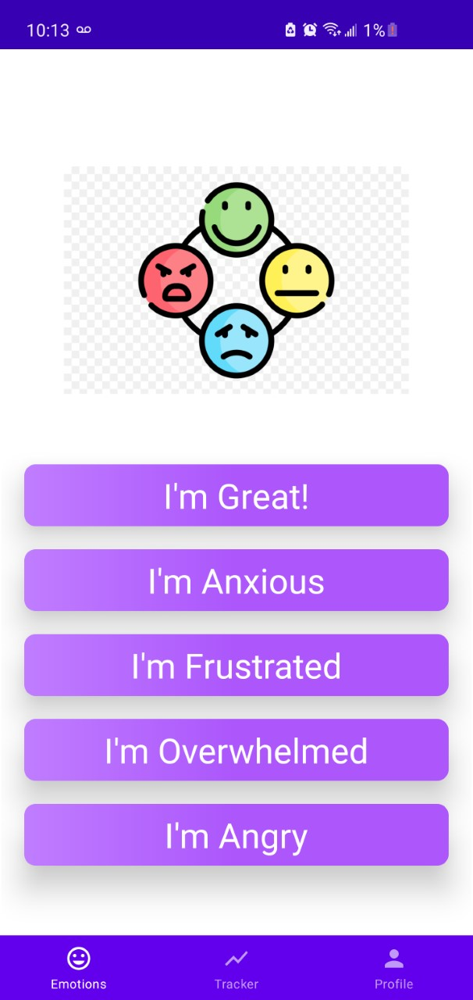
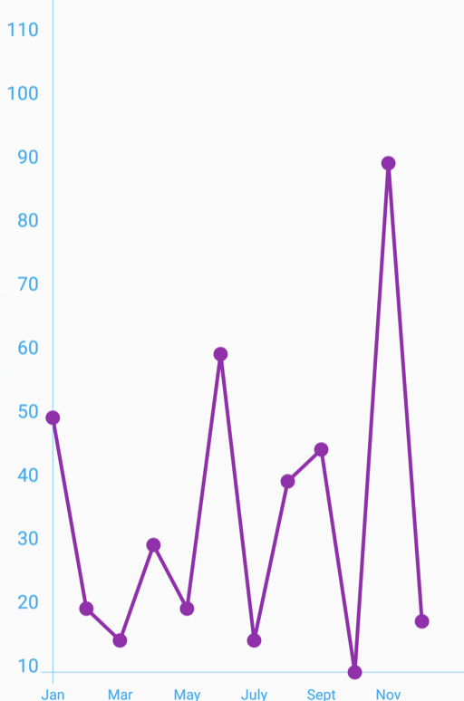

# Emotions-Tracker

This Android application allows users to track their emotions through a simple and intuitive UI. The application has been developed in Java and communicates with MySQL through custom PHP scripts. 
The application features a graph view which shows an overview of patient history (under development!).

